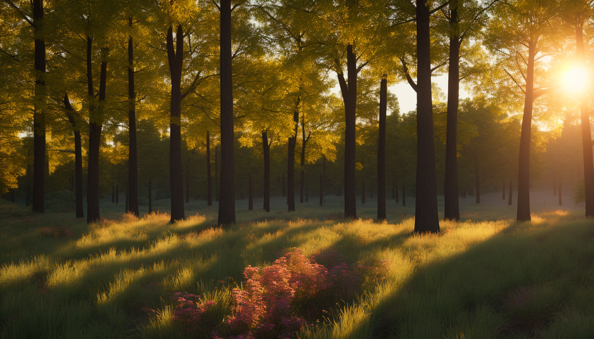

This server fetches images using pexels AI and can also generate them using Stability AI

curl examples -> 
For generation
curl -X POST -H "Content-Type: application/json"      -d '{"prompt": "a knight looking at a castle", "device": "pc"}'      http://127.0.0.1:5000/api/generate -o knight.png

for fetching -> 
curl "http://127.0.0.1:5000/api/fetch?query=tokyo+street&device=mobile" -o tokyo_mobile.jpg

wallpaperBot_local is for running stability diffusion model on local machine

I have uploaded a few examples from model = stabilityai/stable-diffusion-2 in the repo

You Can also try other stable-diffusion models based on your machine like -> 
stabilityai/stable-diffusion-2-1
stabilityai/stable-diffusion-xl-base-1.0
runwayml/stable-diffusion-v1-5
