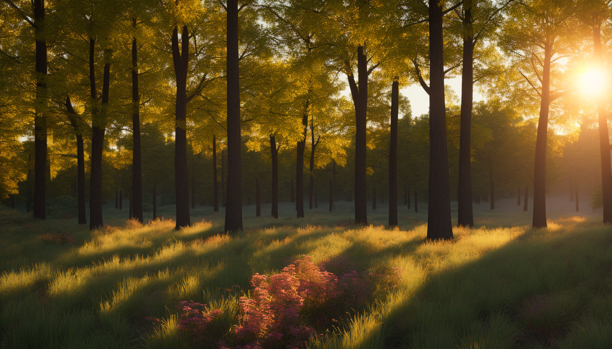

This server fetches images using pexels AI and can also generate them using Stability AI  
 
curl examples ->  
For generation 
curl -X POST -H "Content-Type: application/json"      -d '{"prompt": "a knight looking at a castle", "device": "pc"}'      http://127.0.0.1:5000/api/generate -o knight.png  
 
for fetching ->  
curl "http://127.0.0.1:5000/api/fetch?query=tokyo+street&device=mobile" -o tokyo_mobile.jpg  
 
 
wallpaperBot_local is for running stability diffusion model on local machine 
 
I have uploaded a few examples from model = stabilityai/stable-diffusion-2 in the repo  
  
 
  
 
Created by model = stabilityai/stable-diffusion-xl-base-1.0 for mobile  
  
 
You Can also try other stable-diffusion models based on your machine like ->  
stabilityai/stable-diffusion-2-1  
stabilityai/stable-diffusion-xl-base-1.0  
runwayml/stable-diffusion-v1-5  
